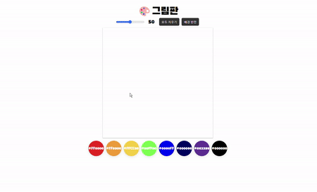

# 1. 그림판 살펴보기 🔎

<p align=center style="color:#b9b9b9">프로젝트 기간 2021.07.12 ~ 2021.07.14</p>

### 🔥 서비스 소개

<h4>간단한 그림을 그릴 수 있는 웹 사이트입니다.</h4>

### ⭐️ 주요 기능

- 붓의 굵기는 1~100까지 조절할 수 있습니다.
- 8가지의 색을 이용할 수 있습니다.
- 캔버스 색상을 반전해서 그릴 수 있습니다.

💻 기술 스택

- `Javascript`
- `Html5`
- `Css3`
- `Canvas`

> #### ⚙ 프로젝트 실행 해보기

```js
git clone https://github.com/dnr14/paintbrush.git
cd paintbrush
npm -g i serve
serve -s .
```

> #### 👨‍💻 구현화면

- [체험하기](https://dnr14.github.io/paintbrush)

<div align=center>
  
</div>
